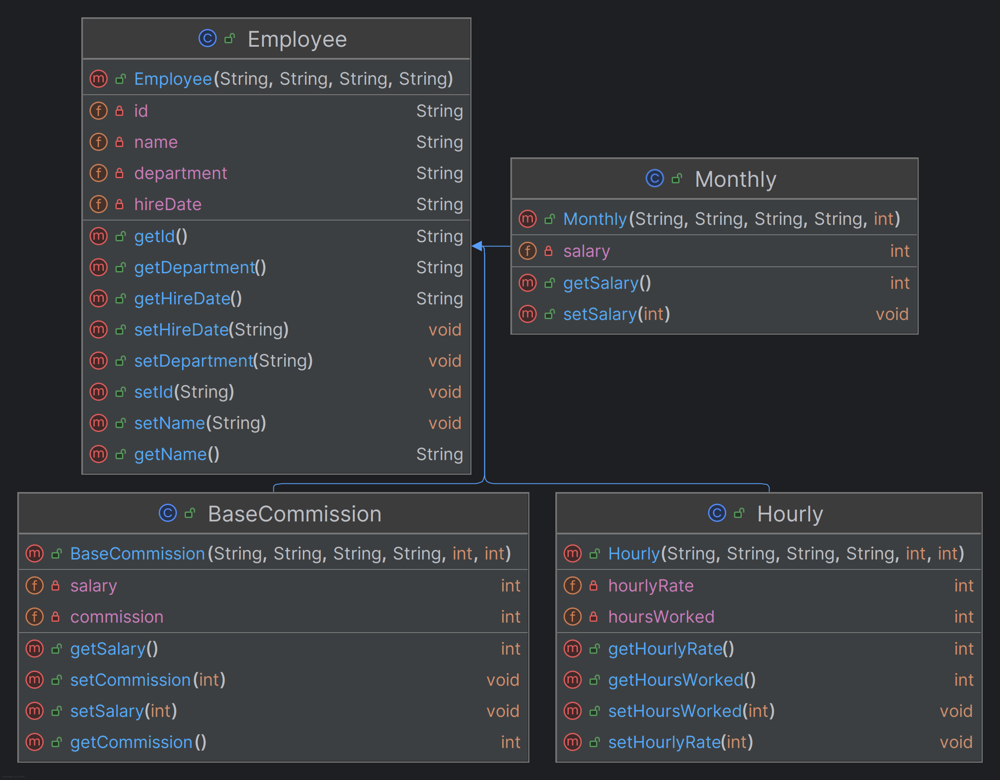

# Proyecto-Pagos

# Employee Payment System

This project simulates an employee payment system for a factory with various payment methods. Employees are paid either a fixed monthly salary, an hourly wage, or a base salary with a commission. The program is designed to manage and register employees, calculate their payments based on their employment type, and display relevant reports.

## Project Description

In this factory, there are three main types of payments for employees:
1. **Monthly Salary**: Employees who are paid a fixed salary every month.
2. **Hourly Wage**: Employees who are paid based on the number of hours worked.
3. **Commission**: Employees who are paid a base salary plus a commission based on their sales.

Each employee has the following attributes:
- **Name**: The name of the employee.
- **ID**: The employee's identification number.
- **Department**: The department where the employee works.
- **Date of Hire**: The date the employee was hired.

The project uses a superclass to define the common attributes for all employees and subclasses for each payment type. These subclasses define additional attributes relevant to their payment method (e.g., monthly salary, hourly rate, hours worked, base salary, and commission).
## Features

- **General Employee List**: Displays all employees, including their name, ID, and department.
- **Monthly Salary Employees**: Lists employees who are paid a monthly salary along with their respective payment.
- **Hourly Wage Employees**: Lists employees who are paid hourly along with their calculated wages.
- **Commission-Based Employees**: Lists employees who are paid based on a base salary and commission, along with their total payment.

All employee lists are displayed in alphabetical order.

## Requirements

- Java SE Development Kit (JDK) 8 or higher.

## How to Run

1. Clone the repository:
   ```bash
   git clone https://github.com/Isaacoun100/-Proyecto-Pagos


